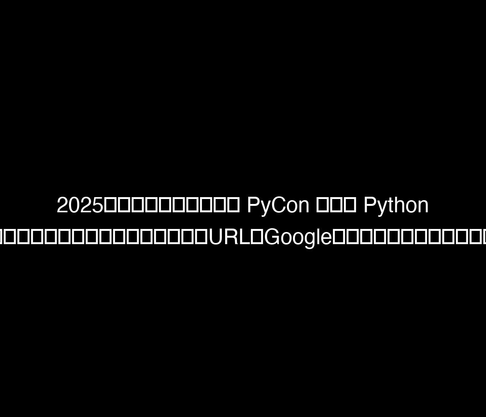

# Hello Browser Use

macOS で [browser-use](https://github.com/browser-use/browser-use) を試した記録。

```shell
python3.13 -m venv .venv
source .venv/bin/activate
pip install browser-use
playwright install
```

.env ファイルを作成し、OPENAI_API_KEY を設定する。

```txt
OPENAI_API_KEY=sk-proj-****
```

公式サイトのサンプルを日本語化して実行する。

```shell
% python main.py 
```

実行すると Chrome が起動し、ブラウザの操作が行われる。

```shell
INFO     [browser_use] BrowserUse logging setup complete with level info
INFO     [root] Anonymized telemetry enabled. See https://github.com/gregpr07/browser-use for more information.
INFO     [agent] 🚀 Starting task: 2025年1月12日にバリからオマーンへの片道フライトをGoogleフライトで探してください。最も安いオプションを教えてください。
INFO     [agent] 
📍 Step 1
INFO     [agent] 🤷 Eval: Unknown - No previous actions to evaluate.
INFO     [agent] 🧠 Memory: Searching for a flight from Bali to Oman on Google Flights for January 12, 2025.
INFO     [agent] 🎯 Next goal: Open Google Flights and search for a one-way flight from Bali to Oman on January 12, 2025.
INFO     [agent] 🛠️  Action 1/1: {"search_google":{"query":"Google Flights Bali to Oman January 12 2025"}}
INFO     [controller] 🔍  Searched for "Google Flights Bali to Oman January 12 2025" in Google
INFO     [agent] 
📍 Step 2
INFO     [agent] 👍 Eval: Success - Searched for the correct query on Google.
INFO     [agent] 🧠 Memory: Searching for a flight from Bali to Oman on Google Flights for January 12, 2025.
INFO     [agent] 🎯 Next goal: Access Google Flights to find the cheapest flight from Bali to Oman on January 12, 2025.
INFO     [agent] 🛠️  Action 1/1: {"click_element":{"index":17}}
INFO     [controller] 🖱️  Clicked index 17
INFO     [agent] 
📍 Step 3
INFO     [agent] 👍 Eval: Success - Accessed the Google Flights page.
INFO     [agent] 🧠 Memory: Searching for a flight from Bali to Oman on Google Flights for January 12, 2025.
INFO     [agent] 🎯 Next goal: Enter flight details for a one-way trip from Bali to Oman on January 12, 2025.
INFO     [agent] 🛠️  Action 1/5: {"click_element":{"index":10}}
INFO     [agent] 🛠️  Action 2/5: {"click_element":{"index":14}}
INFO     [agent] 🛠️  Action 3/5: {"input_text":{"index":14,"text":"Oman"}}
INFO     [agent] 🛠️  Action 4/5: {"click_element":{"index":15}}
INFO     [agent] 🛠️  Action 5/5: {"input_text":{"index":15,"text":"2025-01-12"}}
INFO     [controller] 🖱️  Clicked index 10
INFO     [controller] Something new appeared after action 1 / 5
INFO     [agent] 
📍 Step 4
INFO     [agent] ⚠ Eval: Failed - The flight details were not entered as intended. The destination and date inputs are still pending.
INFO     [agent] 🧠 Memory: Searching for a flight from Bali to Oman on Google Flights for January 12, 2025. Need to update details for a one-way trip and input destination and date.
INFO     [agent] 🎯 Next goal: Switch to one-way trip, enter destination 'Oman', and departure date '2025-01-12'.
INFO     [agent] 🛠️  Action 1/4: {"click_element":{"index":13}}
INFO     [agent] 🛠️  Action 2/4: {"input_text":{"index":17,"text":"Bali"}}
INFO     [agent] 🛠️  Action 3/4: {"input_text":{"index":18,"text":"Oman"}}
INFO     [agent] 🛠️  Action 4/4: {"input_text":{"index":19,"text":"2025-01-12"}}
INFO     [controller] 🖱️  Clicked index 13
ERROR    [agent] ❌ Result failed 1/3 times:
 Error executing action input_text: Failed to input text into element: <span jsaction="click:trigger.JIbuQc" aria-haspopup="true" aria-label="More information on suggested flights." role="button" tabindex="0" class="WTCYAb"> [interactive, top, highlight:17]. Error: ElementHandle.fill: Error: Element is not an <input>, <textarea> or [contenteditable] element
Call log:
    - fill("")
  -   - attempting fill action
  -     - waiting for element to be visible, enabled and editable

INFO     [agent] 
📍 Step 5
INFO     [agent] ⚠ Eval: Failed - Previous actions were not correctly executed; inputs were not filled.
INFO     [agent] 🧠 Memory: Searching for a flight from Bali to Oman on Google Flights for January 12, 2025. Need to update details for a one-way trip and input destination and date.
INFO     [agent] 🎯 Next goal: Switch to one-way trip, enter 'Bali' as the origin, 'Oman' as the destination, and '2025-01-12' as the departure date.
INFO     [agent] 🛠️  Action 1/5: {"click_element":{"index":10}}
INFO     [agent] 🛠️  Action 2/5: {"input_text":{"index":13,"text":"Bali"}}
INFO     [agent] 🛠️  Action 3/5: {"input_text":{"index":14,"text":"Oman"}}
INFO     [agent] 🛠️  Action 4/5: {"click_element":{"index":15}}
INFO     [agent] 🛠️  Action 5/5: {"input_text":{"index":15,"text":"2025-01-12"}}
INFO     [controller] 🖱️  Clicked index 10
INFO     [controller] Something new appeared after action 1 / 5
INFO     [agent] 
📍 Step 6
INFO     [agent] ⚠ Eval: Failed - Previous actions were not correctly executed; inputs were not filled.
INFO     [agent] 🧠 Memory: Searching for a flight from Bali to Oman on Google Flights for January 12, 2025. Need to update details for a one-way trip and input destination and date.
INFO     [agent] 🎯 Next goal: Update origin to 'Bali', destination to 'Oman', and departure date to '2025-01-12'.
INFO     [agent] 🛠️  Action 1/3: {"input_text":{"index":17,"text":"Bali"}}
INFO     [agent] 🛠️  Action 2/3: {"input_text":{"index":18,"text":"Oman"}}
INFO     [agent] 🛠️  Action 3/3: {"input_text":{"index":19,"text":"2025-01-12"}}
INFO     [controller] ⌨️  Input "Bali" into index 17
INFO     [controller] Something new appeared after action 1 / 3
INFO     [agent] 
📍 Step 7
INFO     [agent] ⚠ Eval: Failed - Destination and date not specified yet.
INFO     [agent] 🧠 Memory: Searching for a flight from Bali to Oman on Google Flights for January 12, 2025. Need to input destination and date.
INFO     [agent] 🎯 Next goal: Select 'Bali, Indonesia' as the origin, enter 'Oman' as the destination, and '2025-01-12' as the departure date.
INFO     [agent] 🛠️  Action 1/4: {"click_element":{"index":22}}
INFO     [agent] 🛠️  Action 2/4: {"input_text":{"index":17,"text":"Oman"}}
INFO     [agent] 🛠️  Action 3/4: {"send_keys":{"keys":"Enter"}}
INFO     [agent] 🛠️  Action 4/4: {"input_text":{"index":30,"text":"2025-01-12"}}
INFO     [controller] 🖱️  Clicked index 22
INFO     [controller] Something new appeared after action 1 / 4
INFO     [agent] 
📍 Step 8
INFO     [agent] ⚠ Eval: Failed - Destination and date not yet entered correctly.
INFO     [agent] 🧠 Memory: Searching for a flight from Bali to Oman on Google Flights for January 12, 2025. Need to set destination and date.
INFO     [agent] 🎯 Next goal: Enter 'Oman' as the destination and '2025-01-12' as the departure date.
INFO     [agent] 🛠️  Action 1/3: {"input_text":{"index":14,"text":"Oman"}}
INFO     [agent] 🛠️  Action 2/3: {"send_keys":{"keys":"Enter"}}
INFO     [agent] 🛠️  Action 3/3: {"input_text":{"index":15,"text":"2025-01-12"}}
INFO     [controller] ⌨️  Input "Oman" into index 14
INFO     [controller] ⌨️  Sent keys: Enter
INFO     [controller] ⌨️  Input "2025-01-12" into index 15
INFO     [agent] 
📍 Step 9
INFO     [agent] 👍 Eval: Success - The origin, destination, and date were successfully entered.
INFO     [agent] 🧠 Memory: Searching for a flight from Bali to Oman on Google Flights for January 12, 2025.
INFO     [agent] 🎯 Next goal: Find and extract the cheapest flight option from Bali to Oman for January 12, 2025.
INFO     [agent] 🛠️  Action 1/1: {"click_element":{"index":16}}
INFO     [controller] 🖱️  Clicked index 16
INFO     [agent] 
📍 Step 10
INFO     [agent] 👍 Eval: Success - Entered Google Flights Explore page with destination and date.
INFO     [agent] 🧠 Memory: Searching for a flight from Bali to Oman on Google Flights for January 12, 2025. Need to find the cheapest option.
INFO     [agent] 🎯 Next goal: Identify and extract the cheapest flight option displayed.
INFO     [agent] 🛠️  Action 1/1: {"click_element":{"index":24}}
INFO     [controller] 🖱️  Clicked index 24
INFO     [agent] 
📍 Step 11
INFO     [agent] 👍 Eval: Success - The cheapest flight option is displayed and ready to extract.
INFO     [agent] 🧠 Memory: Found the cheapest flight from Bali to Oman for January 12, 2025.
INFO     [agent] 🎯 Next goal: Extract the details of the cheapest flight option.
INFO     [agent] 🛠️  Action 1/1: {"done":{"text":"The cheapest flight from Bali to Oman on January 12, 2025, is with Malaysia Airlines and Oman Air. It includes 1 stop, takes 44 hours and 55 minutes, and costs ¥64,024 one way."}}
INFO     [agent] 📄 Result: The cheapest flight from Bali to Oman on January 12, 2025, is with Malaysia Airlines and Oman Air. It includes 1 stop, takes 44 hours and 55 minutes, and costs ¥64,024 one way.
INFO     [agent] ✅ Task completed successfully
INFO     [agent] Created GIF at agent_history.gif
AgentHistoryList(all_results=[ActionResult(is_done=False, extracted_content='🔍  Searched for "Google Flights Bali to Oman January 12 2025" in Google', error=None, include_in_memory=True), ActionResult(is_done=False, extracted_content='🖱️  Clicked index 17', error=None, include_in_memory=True), ActionResult(is_done=False, extracted_content='🖱️  Clicked index 10', error=None, include_in_memory=True), ActionResult(is_done=False, extracted_content=None, error='Error executing action input_text: Failed to input text into element: <span jsaction="click:trigger.JIbuQc" aria-haspopup="true" aria-label="More information on suggested flights." role="button" tabindex="0" class="WTCYAb"> [interactive, top, highlight:17]. Error: ElementHandle.fill: Error: Element is not an <input>, <textarea> or [contenteditable] element\nCall log:\n    - fill("")\n  -   - attempting fill action\n  -     - waiting for element to be visible, enabled and editable\n', include_in_memory=True), ActionResult(is_done=False, extracted_content='🖱️  Clicked index 10', error=None, include_in_memory=True), ActionResult(is_done=False, extracted_content='⌨️  Input "Bali" into index 17', error=None, include_in_memory=True), ActionResult(is_done=False, extracted_content='🖱️  Clicked index 22', error=None, include_in_memory=True), ActionResult(is_done=False, extracted_content='⌨️  Input "Oman" into index 14', error=None, include_in_memory=True), ActionResult(is_done=False, extracted_content='⌨️  Sent keys: Enter', error=None, include_in_memory=True), ActionResult(is_done=False, extracted_content='⌨️  Input "2025-01-12" into index 15', error=None, include_in_memory=True), ActionResult(is_done=False, extracted_content='🖱️  Clicked index 16', error=None, include_in_memory=True), ActionResult(is_done=False, extracted_content='🖱️  Clicked index 24', error=None, include_in_memory=True), ActionResult(is_done=True, extracted_content='The cheapest flight from Bali to Oman on January 12, 2025, is with Malaysia Airlines and Oman Air. It includes 1 stop, takes 44 hours and 55 minutes, and costs ¥64,024 one way.', error=None, include_in_memory=False)], all_model_outputs=[{'search_google': {'query': 'Google Flights Bali to Oman January 12 2025'}}, {'click_element': {'index': 17}}, {'click_element': {'index': 10}}, {'click_element': {'index': 14}}, {'input_text': {'index': 14, 'text': 'Oman'}}, {'click_element': {'index': 15}}, {'input_text': {'index': 15, 'text': '2025-01-12'}}, {'click_element': {'index': 13}}, {'input_text': {'index': 17, 'text': 'Bali'}}, {'input_text': {'index': 18, 'text': 'Oman'}}, {'input_text': {'index': 19, 'text': '2025-01-12'}}, {'click_element': {'index': 10}}, {'input_text': {'index': 13, 'text': 'Bali'}}, {'input_text': {'index': 14, 'text': 'Oman'}}, {'click_element': {'index': 15}}, {'input_text': {'index': 15, 'text': '2025-01-12'}}, {'input_text': {'index': 17, 'text': 'Bali'}}, {'input_text': {'index': 18, 'text': 'Oman'}}, {'input_text': {'index': 19, 'text': '2025-01-12'}}, {'click_element': {'index': 22}}, {'input_text': {'index': 17, 'text': 'Oman'}}, {'send_keys': {'keys': 'Enter'}}, {'input_text': {'index': 30, 'text': '2025-01-12'}}, {'input_text': {'index': 14, 'text': 'Oman'}}, {'send_keys': {'keys': 'Enter'}}, {'input_text': {'index': 15, 'text': '2025-01-12'}}, {'click_element': {'index': 16}}, {'click_element': {'index': 24}}, {'done': {'text': 'The cheapest flight from Bali to Oman on January 12, 2025, is with Malaysia Airlines and Oman Air. It includes 1 stop, takes 44 hours and 55 minutes, and costs ¥64,024 one way.'}}])
```

agent_history.gif が作成された。


